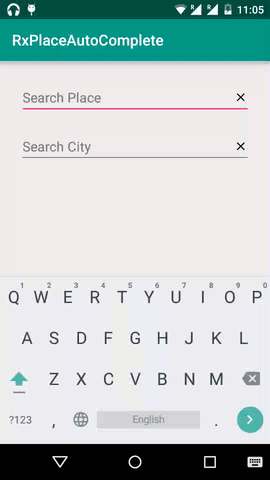

# RxPlaceAutoComplete -
An Example Android Studio project using [Retrofit](http://square.github.io/retrofit/) & [Google Places API](https://developers.google.com/places/) to provide Places/ Cities with [AutoCompleteTextField](http://developer.android.com/reference/android/widget/AutoCompleteTextView.html)  in Android.

An AutocompleteTextView that interacts with the Google Maps Places API to provide location results.
* Saves users times while typing.
* Reduce Spelling mistakes.
* Improve User Experience

Quick Start:

1. Download this project

2. You'll need a Google Server API key for this application. There are instructions on how to set up your API project and generate a key [here](https://developers.google.com/places/web-service/get-api-key)

3. Add Google Server API key in [MainActivity.Java](https://github.com/venkatselva8/RxPlaceAutoComplete/blob/master/app/src/main/java/com/venkytuts/rxplaceautocomplete/MainActivity.java) 

4. Now Run the Project. Happy Coding :)

Note:
 
 Sample Google Maps Places - Request & Response available [here](https://github.com/venkatselva8/RxPlaceAutoComplete/blob/master/GitFiles/SampleReqResp.txt)
 
 Suggestions are welcome. :)
 Sent to venkatselva8@gmail.com

